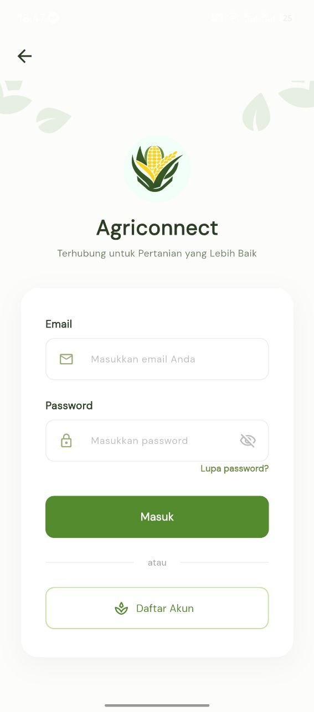
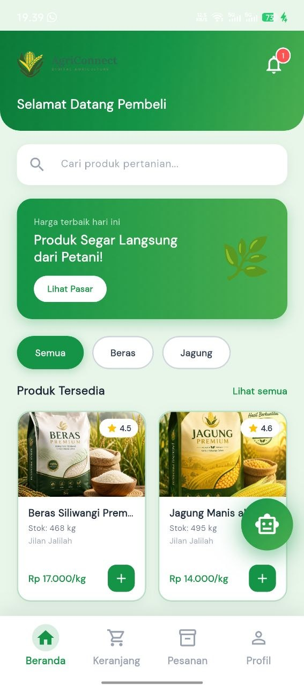
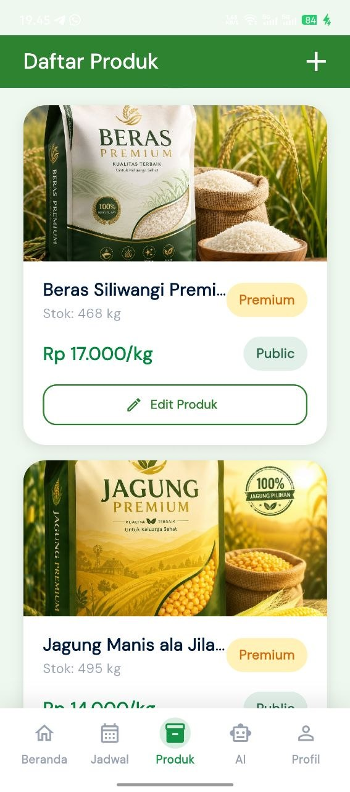
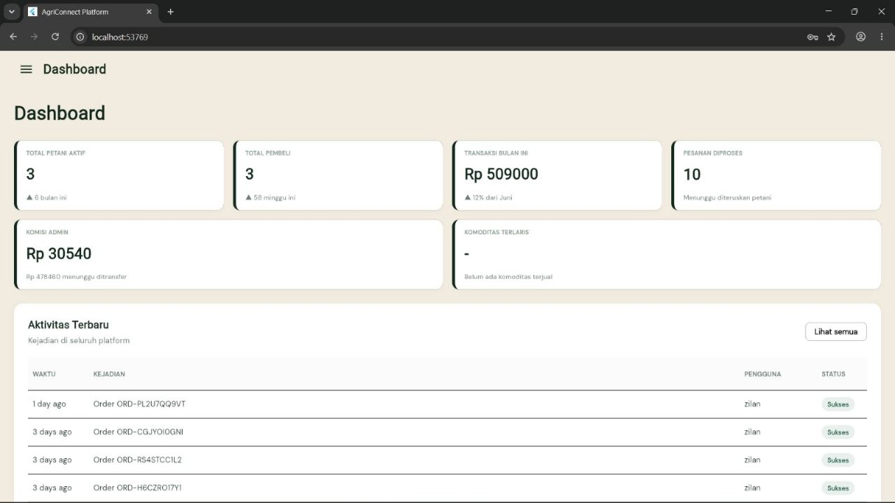
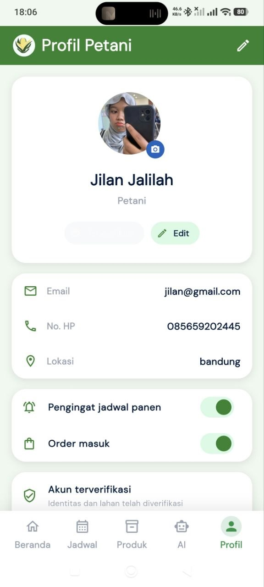

# 🌾 AgriConnect

**Platform Pertanian Digital Terpadu — Beras & Jagung**
Platform digital berbasis Mobile & Web untuk mempertemukan petani dan konsumen secara langsung.

*Tugas Besar Rekayasa Sistem Informasi — Kelompok 5*
*Program Studi Sistem Informasi — Universitas Kebangsaan Republik Indonesia (UKRI), 2026*

---

## 📌 Tentang Proyek

**AgriConnect** adalah platform digital berbasis mobile dan web yang dirancang untuk membantu petani dalam memasarkan hasil pertanian (khususnya beras dan jagung), memperoleh informasi pertanian, serta mempermudah interaksi langsung antara petani dan konsumen tanpa perantara.

### Latar Belakang

Di era digital saat ini, sektor pertanian masih menghadapi berbagai kendala, di antaranya:

- Sulitnya pemasaran hasil panen
- Kurangnya akses informasi pertanian
- Keterbatasan komunikasi antara petani dan konsumen
- Pengelolaan data pertanian yang belum terintegrasi

AgriConnect hadir sebagai solusi digital untuk membantu proses pertanian menjadi lebih efektif, modern, dan terhubung antara petani dan konsumen.

### Tujuan Proyek

- Membantu petani memasarkan hasil tani secara digital
- Mempermudah konsumen dalam mencari produk pertanian
- Menyediakan informasi dan konsultasi pertanian
- Mendukung digitalisasi sektor pertanian

---

## ✨ Fitur Utama

### 📱 Mobile App (Petani & Pembeli)

| Fitur | Deskripsi |
|-------|-----------|
| Login & Register | Autentikasi pengguna dengan role Petani atau Pembeli |
| Marketplace Hasil Tani | Pembeli dapat mencari, melihat harga, dan membeli produk (beras/jagung) langsung dari petani |
| Manajemen Produk (Petani) | Petani dapat menambah, mengedit, dan memantau stok produk yang dijual |
| Jadwal Panen | Pengingat dan pencatatan jadwal panen untuk petani |
| Asisten AI | Fitur AI untuk membantu konsultasi/pertanyaan seputar pertanian |
| Profil Pengguna | Kelola data diri, kontak, lokasi, dan status verifikasi akun |
| Notifikasi | Notifikasi order masuk dan pengingat jadwal panen |

### 💻 Web Admin

| Fitur | Deskripsi |
|-------|-----------|
| Dashboard Admin | Ringkasan total petani aktif, total pembeli, transaksi bulanan, komisi admin, dan komoditas terlaris |
| Monitoring Aktivitas | Log aktivitas transaksi terbaru di seluruh platform beserta status |
| Manajemen Pengguna | Kelola data akun petani dan pembeli, termasuk profil dan verifikasi |
| Manajemen Produk | Pemantauan data produk pertanian yang terdaftar di platform |
| Laporan Transaksi & Komisi | Rekap transaksi dan perhitungan komisi admin secara otomatis |

---

## 🖥️ Tampilan Aplikasi

### 📱 Mobile App

**Halaman Login**



*Halaman awal aplikasi dengan opsi Login dan Daftar Sekarang*

**Beranda Pembeli**



*Beranda untuk pembeli menampilkan pencarian produk, promo, dan daftar produk tersedia (Beras & Jagung) lengkap dengan harga dan rating*

**Daftar Produk (Petani)**



*Halaman manajemen produk untuk petani — menampilkan stok, harga, status publikasi, dan opsi edit produk*

### 💻 Web Admin

**Dashboard Admin**



*Dashboard menampilkan ringkasan total petani aktif, total pembeli, transaksi bulan ini, pesanan diproses, komisi admin, dan aktivitas terbaru platform*

**Profil Petani**



*Halaman profil petani menampilkan data diri, kontak, lokasi, pengaturan notifikasi, dan status verifikasi akun*

---

## 🛠️ Teknologi yang Digunakan

| Kategori | Teknologi |
|----------|-----------|
| Mobile App | Flutter, Dart |
| Web / Landing Page | PHP (Laravel Blade) |
| Backend | Laravel (REST API) + Laravel Sanctum (autentikasi token) |
| Database | MySQL |
| Project Management | GitHub Projects, GitHub Issues, GitHub Milestones |

---

## 🏗️ Infrastruktur

- **Arsitektur:** Client-Server — Mobile App & Web berkomunikasi dengan Backend melalui REST API
- **Backend Server:** Laravel (PHP) dengan Laravel Sanctum untuk autentikasi berbasis token
- **Database Server:** MySQL sebagai penyimpanan data utama
- **Tunneling (Development):** ngrok — digunakan untuk mengekspos server lokal saat pengembangan/demo

```
[ Mobile App (Flutter/Dart) ]        [ Web / Landing Page (PHP - Laravel Blade) ]
              \                                    /
               \                                  /
                \                                /
              [ Backend REST API - Laravel + Sanctum ]
                                |
                          [ Database MySQL ]
```

---

## 📂 Struktur Folder

```
Projrct-Kelompok-5/
│
├── docs/
│   ├── SRS.docx
│   ├── ERD.png
│   ├── DFD.png
│   └── UseCase.png
│
├── design/
│   ├── wireframe/
│   └── mockup/
│
├── be/                     # Backend - Laravel REST API + Sanctum
│   └── .env.example
│
├── fe/                     # Web / Landing Page - PHP (Laravel Blade)
│
└── README.md
```

---

## 🚀 Cara Instalasi & Penggunaan

### Prasyarat

- PHP >= 8.1 & Composer
- Flutter SDK (untuk aplikasi mobile)
- MySQL Server
- Git

### 1. Clone Repository

```bash
git clone https://github.com/jilanjalilah06-png/Projrct-Kelompok-5.git
cd Projrct-Kelompok-5
```

### 2. Setup Backend (folder `be/`)

```bash
cd be
composer install
cp .env.example .env
php artisan key:generate
php artisan sanctum:install
```

Atur koneksi database pada file `.env`:

```
DB_CONNECTION=mysql
DB_HOST=127.0.0.1
DB_PORT=3306
DB_DATABASE=agriconnect_db
DB_USERNAME=root
DB_PASSWORD=
```

Jalankan migrasi database dan server:

```bash
php artisan migrate
php artisan serve
```

### 3. Setup Web / Landing Page (folder `fe/`)

Web/landing page menggunakan PHP (Laravel Blade), dijalankan menyatu dengan project Laravel pada folder `be/` melalui `php artisan serve`, atau sesuai konfigurasi routing pada folder `fe/` bila berdiri sendiri.

### 4. Setup Mobile App

```bash
cd ../pangan_mobile   # sesuaikan dengan nama folder aplikasi Flutter
flutter pub get
flutter run
```

Pastikan `base URL` API pada aplikasi mobile sudah diarahkan ke alamat backend (localhost/ngrok) yang sedang berjalan.

### 5. Cara Penggunaan

1. Jalankan backend, web, dan mobile app.
2. Login menggunakan salah satu akun demo di bawah, atau registrasi akun baru sebagai **Petani** atau **Pembeli**.
3. Petani dapat menambahkan produk hasil panen (beras/jagung) beserta stok dan harga ke marketplace.
4. Pembeli dapat menelusuri produk, melihat harga & rating, lalu melakukan pemesanan.
5. Admin memantau seluruh data petani, pembeli, transaksi, dan komisi melalui Web Dashboard.

### Akun Demo

| Role | Email | Password |
|------|-------|----------|
| Petani | jilan@gmail.com | Jln2306 |
| Pembeli | zizi@gmail.com | zizi2306 |
| Admin | admin@agriconnect.com | password123 |

---

## 👥 Tim Pengembang — Kelompok 5

| No | Nama | NPM | Role | Tanggung Jawab |
|----|------|-----|------|-----------------|
| 1 | Jilan Jalilah | 20241320039 | Project Manager | Mengatur timeline dan koordinasi project |
| 2 | Keysha Aprilya Salsabila | 20241320032 | System Analyst | Analisis kebutuhan sistem dan dokumentasi |
| 3 | Jopan Maurizt Latue | 20241320040 | Frontend Web Developer | Pengembangan website admin |
| 4 | Arya Adi Muhammad Iqbal | 20241320018 | Backend Developer | Pengembangan API dan database |
| 5 | Ridho Gustama | 20241320027 | QA/QC | Pengujian sistem dan quality control |

> **Catatan Perubahan Tim:** Dinda Italia (sebelumnya QA/QC) tidak dapat mengikuti UAS, sehingga tanggung jawab QA/QC dialihkan kepada Ridho Gustama (sebelumnya Frontend Mobile). Posisi Frontend Mobile tidak digantikan oleh anggota lain untuk periode UAS ini.

---

## 📅 Timeline Project

| Sprint | Fokus |
|--------|-------|
| Sprint 1 | Analisis Sistem |
| Sprint 2 | UI/UX dan Perancangan Sistem |
| Sprint 3 | Frontend & Backend Mobile dan Web |
| Sprint 4 | Testing dan Finalisasi |

---

## 📄 Dokumen Terkait

- 📘 **SRS (Software Requirements Specification):** `docs/SRS.docx`
- 📊 **Diagram:** `docs/ERD.png`, `docs/DFD.png`, `docs/UseCase.png`

---

## 📜 Lisensi

Proyek ini dibuat untuk keperluan akademik (Tugas UAS Rekayasa Sistem Informasi) — Universitas Kebangsaan Republik Indonesia (UKRI), 2026.
